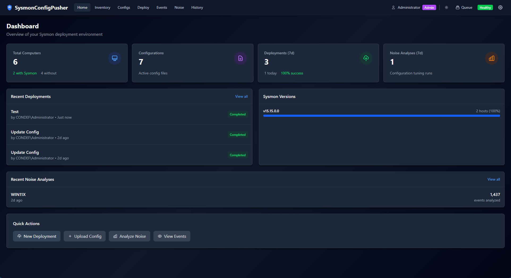
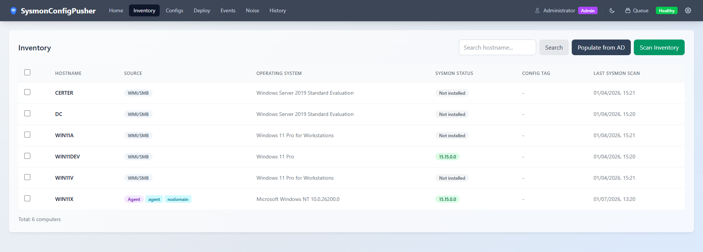
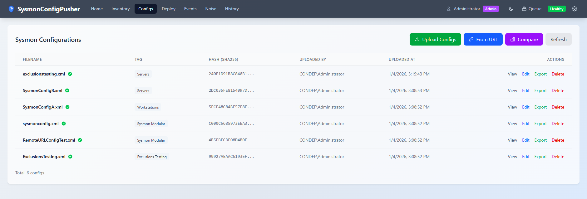
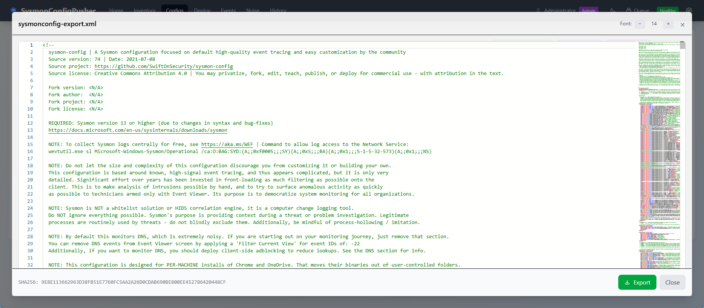
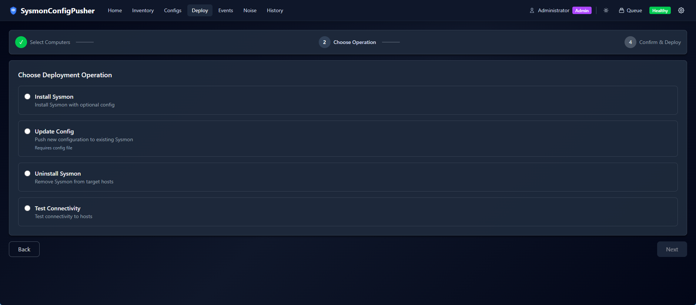
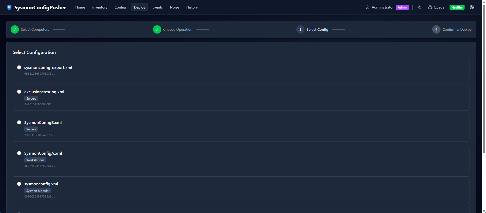
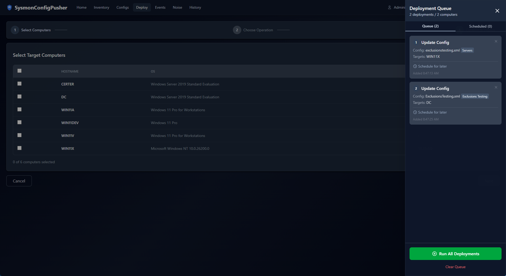
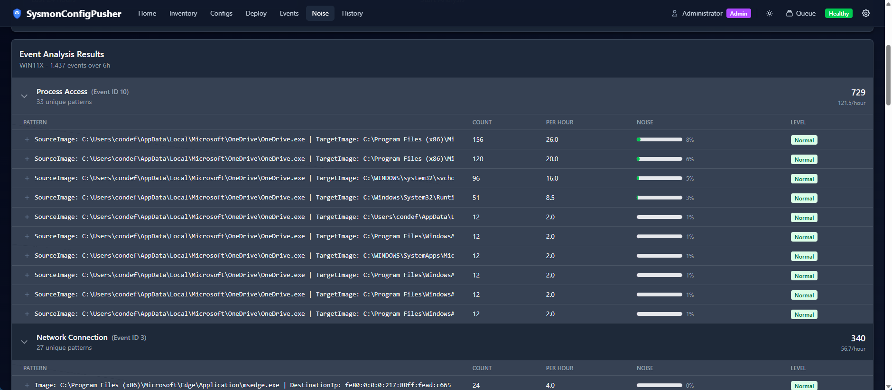

<p align="center">
  <h1 align="center">SysmonConfigPusher v2</h1>
  <p align="center">
    A web-based tool for managing Sysmon configurations across Windows endpoints — supports both agentless (WMI/SMB) and agent-based deployments.
  </p>
</p>

<p align="center">
  <a href="https://github.com/Antonlovesdnb/SysmonConfigPusher2/actions/workflows/ci.yml"></a>
  <a href="https://github.com/Antonlovesdnb/SysmonConfigPusher2/releases/latest"></a>
  
  
  <a href="LICENSE"></a>
  <a href="https://claude.ai"></a>
</p>

---

## Features

| Feature | Description |
|---------|-------------|
| **Agentless Deployment** | Push Sysmon binaries and configs via WMI and SMB |
| **Agent Support** | Lightweight agent for cloud VMs and DMZ servers |
| **Docker Support** | Run on Linux/Docker for agent-only deployments |
| **Web Interface** | Modern React UI with real-time deployment progress |
| **Event Log Viewer** | Query Sysmon logs from remote hosts |
| **Noise Analysis** | Identify high-volume events to tune configurations |
| **Scheduled Deployments** | Schedule deployments for future execution |
| **Flexible Auth** | Windows Integrated Auth or API keys |

### Screenshots

| Dashboard | Inventory |
|-----------|-----------|
|  |  |

| Config View | Config Editor |
|-------------|---------------|
|  |  |

| Deployment Wizard | Deployment Progress |
|-------------------|---------------------|
|  |  |

| Schedule Deployments | Noise Analysis |
|----------------------|----------------|
|  |  |


## Quick Start

### Option 1: MSI Installer (Windows Server)

1. Download the latest [SysmonConfigPusher.msi](https://github.com/Antonlovesdnb/SysmonConfigPusher2/releases/latest)
2. Run the installer as Administrator
3. Configure a domain service account ([see docs](docs/INSTALLATION.md#step-4-configure-service-account))
4. Start the service and access the web UI (default port: 5001, configurable in `appsettings.json`)

### Option 2: Docker (Agent-Only Mode)

```bash
docker run -d --name sysmonpusher \
  -p 5001:5001 \
  -v sysmonpusher-data:/data \
  -e API_KEY_ADMIN="your-admin-key" \
  -e AGENT_TOKEN="your-agent-token" \
  ghcr.io/antonlovesdnb/sysmonconfigpusher2:latest
```

Access the UI at `https://localhost:5001` (self-signed certificate warning expected).

See [Docker Guide](docs/DOCKER.md) for full configuration options.

### Option 3: Build from Source

See the [Development Guide](docs/DEVELOPMENT.md) for building and running locally.

## Documentation

| Guide | Description |
|-------|-------------|
| [Installation Guide](docs/INSTALLATION.md) | Production deployment on Windows Server |
| [Usage Guide](docs/USAGE.md) | How to use the application, config tagging (SCPTAG) |
| [Agent Guide](docs/AGENTS.md) | Deploying and managing the lightweight agent |
| [Docker Guide](docs/DOCKER.md) | Container deployment, backup, and recovery |
| [Certificate Guide](docs/CERTIFICATES.md) | TLS configuration for server and agents |
| [Deployment Modes](docs/DEPLOYMENT_MODES.md) | Full vs Agent-Only mode comparison |
| [Development Guide](docs/DEVELOPMENT.md) | Building from source, running locally |

## Requirements

### Full Mode (Windows Server)

- **Server**: Windows Server 2016+ (domain-joined)
- **Service Account**: Domain account with local admin rights on target endpoints
- **Network Ports**: TCP 135 (WMI), 445 (SMB), 49152-65535 (RPC dynamic)

### Agent-Only Mode (Docker/Linux)

- **Server**: Any platform with Docker or Linux
- **Agents**: Windows endpoints with agent installed ([Agent Guide](docs/AGENTS.md))
- **Network**: Agents connect outbound to server on HTTPS (port 5000/5001)

See [Deployment Modes](docs/DEPLOYMENT_MODES.md) for a detailed comparison.

## Architecture

```
┌─────────────────────────────────────────────────────────────────────┐
│                          Web Browser                                │
│              (Windows Auth or API Key Authentication)               │
└─────────────────────────────┬───────────────────────────────────────┘
                              │ HTTPS
                              ▼
┌─────────────────────────────────────────────────────────────────────┐
│                    SysmonConfigPusher Server                        │
│                (Windows Service or Docker Container)                │
│                                                                     │
│  ┌─────────────┐  ┌──────────────┐  ┌────────────────────────────┐  │
│  │  REST API   │  │ SignalR Hub  │  │  Background Workers        │  │
│  │  (Configs,  │  │ (Real-time   │  │  (Deployments, Scans,      │  │
│  │  Deploy)    │  │  Progress)   │  │   Scheduled Jobs)          │  │
│  └─────────────┘  └──────────────┘  └────────────────────────────┘  │
│  ┌────────────────────────────────────────────────────────────────┐ │
│  │                    SQLite Database                             │ │
│  │    (Configs, Inventory, Deployments, Audit Log)                │ │
│  └────────────────────────────────────────────────────────────────┘ │
└───────────────────┬─────────────────────────────┬───────────────────┘
                    │                             │
        WMI + SMB   │                             │  HTTPS (Agent API)
      (Full Mode)   │                             │  (Agent-Only Mode)
                    ▼                             ▼
┌───────────────────────────────┐   ┌───────────────────────────────┐
│     Domain Endpoints          │   │     Cloud/DMZ Endpoints       │
│        (Agentless)            │   │      (Lightweight Agent)      │
│                               │   │                               │
│  • Direct WMI execution       │   │  • Agent polls for commands   │
│  • SMB file transfer          │   │  • Outbound HTTPS only        │
│  • Remote event log queries   │   │  • No inbound ports needed    │
└───────────────────────────────┘   └───────────────────────────────┘
```

## Tech Stack

| Layer | Technologies |
|-------|--------------|
| **Backend** | ASP.NET Core 8, Entity Framework Core, SQLite |
| **Frontend** | React 18, TypeScript, Tailwind CSS, Vite |
| **Real-time** | SignalR WebSockets |
| **Deployment** | Windows Service, Docker, MSI Installer (WiX) |
| **Agent** | .NET 8 self-contained Windows Service |

## Contributing

Contributions are welcome! Please feel free to submit a Pull Request.

## License

This project is licensed under the MIT License - see the [LICENSE](LICENSE) file for details.

## Acknowledgments

This is a modernization of the original [SysmonConfigPusher](https://github.com/LaresLLC/SysmonConfigPusher) WPF application.
